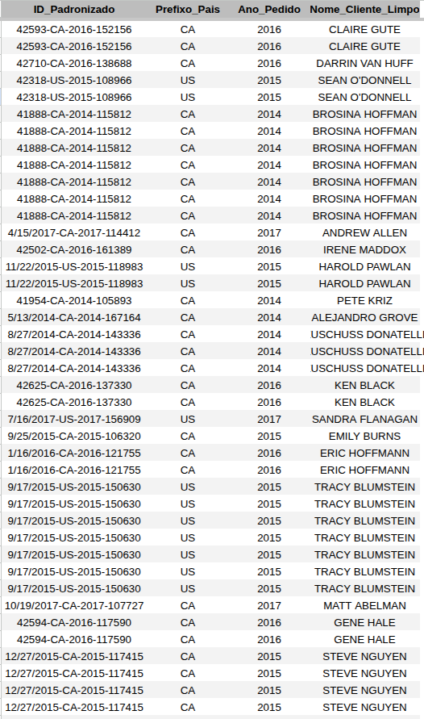

# 📊 Superstore Data Pipeline - Google Sheets

Este repositório contém um pipeline de dados completo desenvolvido no Google Sheets, simulando um ambiente real de Business Intelligence. O projeto abrange desde a ingestão de dados brutos até a entrega de um dashboard interativo.

## 📁 Estrutura do Projeto

### 1. Ingestão e Estruturação (`Base_Bruta`)
Os dados originais em formato CSV foram processados e estruturados para garantir a integridade de 21 atributos de vendas, permitindo análises granulares por região, categoria e tempo.

### 2. Transformação e Limpeza (ETL) (`ETL_Limpeza`)
Nesta etapa, apliquei lógica de processamento automatizado via **Matrizes Dinâmicas (`ARRAYFORMULA`)**:
* **Sanitização:** Limpeza de strings com `UPPER` e `TRIM` para padronização de nomes de clientes.
* **Feature Engineering:** Extração automática de metadados como `Ano_Pedido` e `Prefixo_Pais`.

### 3. Dashboard Interativo (`Analise_Dinamica`)
O produto final é um dashboard dinâmico que utiliza a função `FILTER` conectada a parâmetros de entrada:
* **Interface:** Design "Clean" com remoção de linhas de grade e congelamento de cabeçalhos.
* **KPIs:** Visualização de vendas e lucros formatada para tomada de decisão rápida.

---
## 🎓 Sobre o Autor
**Maicon Henrique**
📍 Campina Grande - PB
🎓 Graduando em Ciência de Dados na **UEPB**
🎯 Foco em: Data Analytics, ETL e Business Intelligence.
