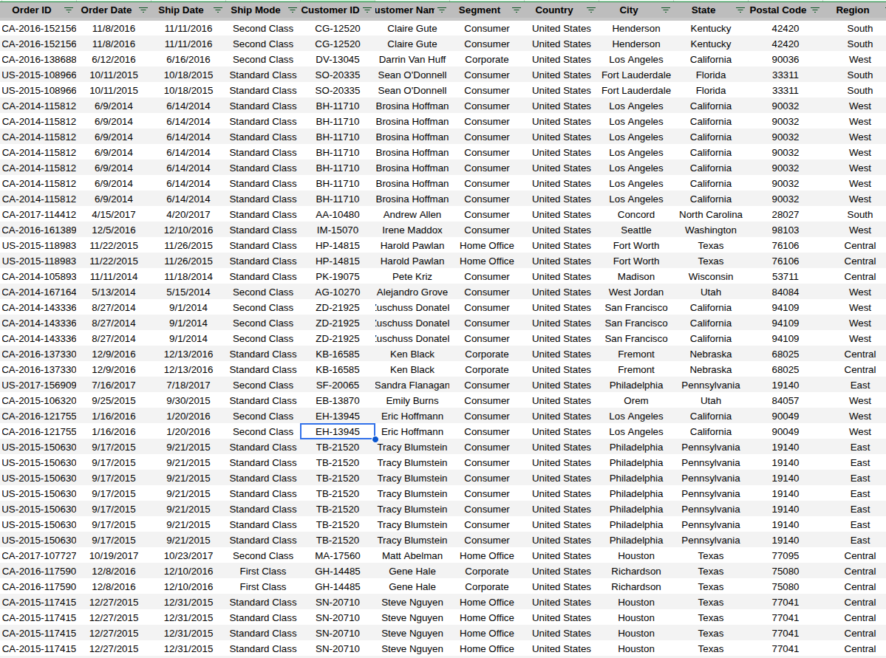
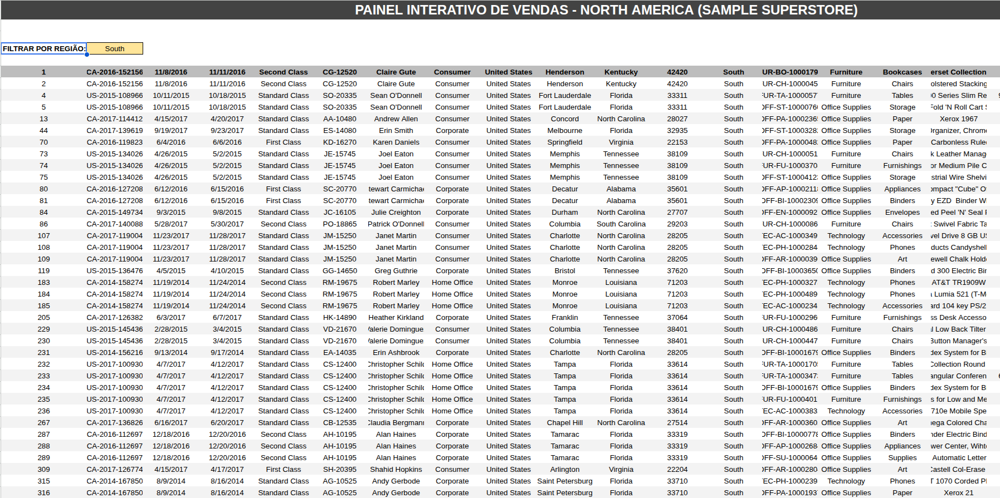

# Superstore-Data-Pipeline-Sheets 📊

Pipeline de dados e Dashboard dinâmico desenvolvido inteiramente no Google Sheets, focado em análise de performance de vendas e automação de processos de BI.

[🔗 Acesse a Planilha Interativa aqui](https://docs.google.com/spreadsheets/d/1toAkrp5Wl9611jqNeFpFpNJfVPJKN1I3lznShc-DU-Q/edit?usp=sharing)

## 🚀 Sobre o Projeto
Este projeto simula um cenário real de análise de dados de uma varejista global (Sample Superstore). O objetivo foi transformar dados brutos em insights estratégicos através de um fluxo automatizado.

### Etapas do Pipeline:
1. **Ingestão:** Conexão com a base de dados bruta (dataset de 9k+ linhas).
2. **ETL (Processamento):** Limpeza, padronização e criação de colunas calculadas.
3. **Visualização:** Dashboard interativo com filtros dinâmicos.

## 📸 Demonstração do Fluxo

### 01. Ingestão e Tratamento (ETL)

*Automação de limpeza de dados utilizando ArrayFormula.*

### 02. Processamento e Métricas

*Criação de tabelas auxiliares e lógica de BI para suporte ao Dashboard.*

### 03. Dashboard Estratégico Final

*Painel interativo com indicadores de vendas por categoria e região.*

## 🛠️ Tecnologias e Funções Utilizadas
* **Engine:** Google Sheets (Lógica de Business Intelligence).
* **Matrizes Dinâmicas (`ARRAYFORMULA`):** Processamento de dados em massa.
* **Consultas Dinâmicas (`FILTER` & `QUERY`):** Motor de busca para atualização automática dos gráficos.
* **Data Cleaning:** Padronização com `TRIM`, `UPPER` e `IFERROR`.

## 💾 Sobre os Dados
A base de dados bruta utilizada neste projeto está disponível na pasta `/data` deste repositório (**Sample - Superstore.csv**).

---
**Desenvolvido por Maicon Henrique de Oliveira Gomes** Estudante de Tecnologia em Ciência de Dados - UEPB | Campina Grande, PB
